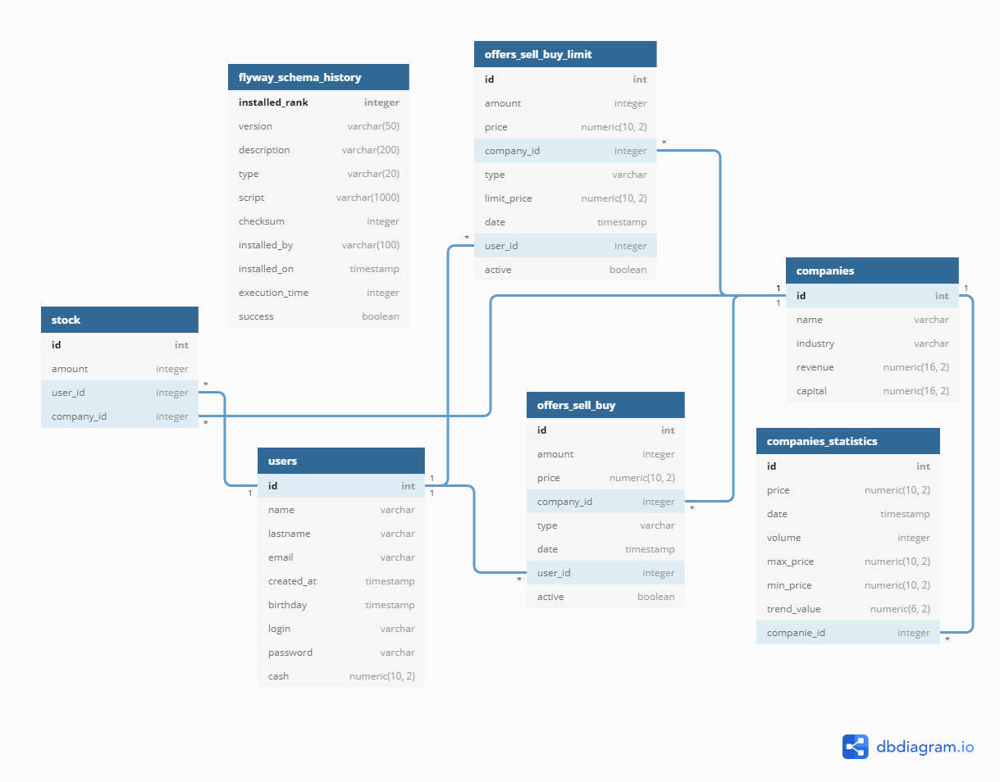

# Exchange Trading
It's main application of the entire Exchange-Trading project.  
Application contains all mechanisms that are responsible for the proper functioning of the stock exchange.
 
## Technologies
- Java 8
- Spring Boot 2.2.6
- Hibernate
- Maven
- Docker
- Swagger
- Prometheus

## Endpoints
#### Main endpoints:
- ``/company`` - service and operations on listed companies
- ``/companyStatistics``  service and operations on stocks of company price statistics
- ``/offerSellBuy`` - service and operations on sell/buy quick transaction
- ``/offerSellBuyLimit`` - service and operations on sell/buy limit offer
- ``/stock`` - service and operations on stock transactions
- ``/user`` - service and operations on users
    
    All endpoints are presented on **swagger-ui** (http://localhost:8080/swagger-ui.html)
 
## Data model
<p align="center"></p>

## Setup

App starts on port 8080. You can starts app using maven, IDE or Docker.
To use Docker, first you have to build project:
```
mvn install
```
Then, you can create custom Docker image which including Exchange-Trading:
```
docker build -t <image_name>:<tag> .
```
To run application on Docker you must start container:
```
docker run -d -p 8080:8080 <image_name>
```

## Linked repositoris
* [Exchange-Trading-Tester](https://github.com/pkwasek08/Exchange-Trading-Tester)    
* [Exchange-Trading-App](https://github.com/pkwasek08/Exchange-Trading-App)  
* [Exchange-Trading-DevOps](https://github.com/pkwasek08/Exchange-Trading-DevOps)